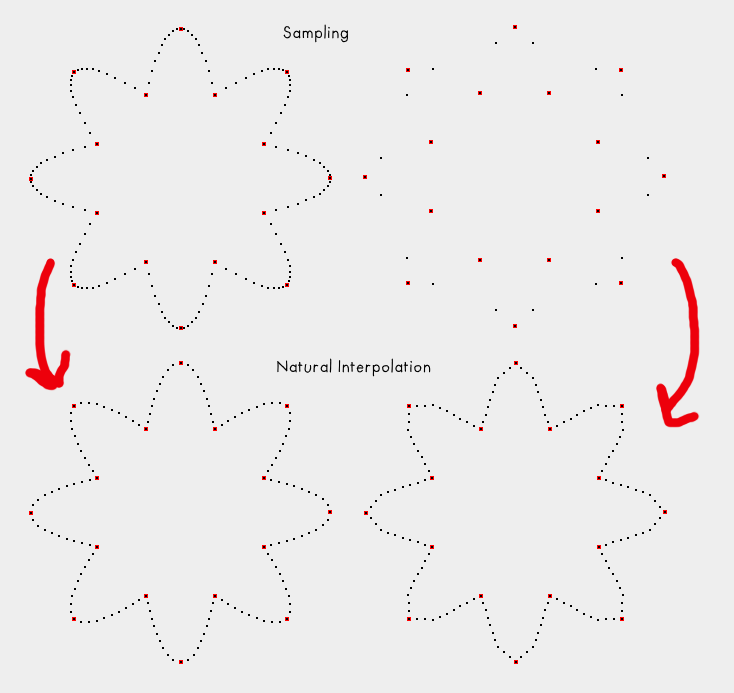

# SplineLib

A library for particle path and shape creation. Work on this library is still in progress! Use classes with caution
until release 1.0

TODO erklärendes Bild

## Contents
- [Usage](#usage)
  - [Splines and Terminology](#splines-and-terminology)
  - [Shapes](#shapes)
  - [Registering the Library](#registering-the-library)
  - [Builder](#builder)
    - [Instantiating](#instantiating)
    - [Rounding Interpolator](#rounding-interpolator)
    - [Spacing Interpolator](#spacing-interpolators)
    - [Closing Splines](#closing-the-path)
    - [Filters and Processors](#filters-and-processors)
  - [Creating Phases](#)
- [Examples](#)

## Usage

### Splines and Terminology

The term "spline" is used to describe smoothing and interpolating functions. In this library, "spline" explicitly means
curves that are defined by any amount of control points. So all those examples are splines:

(white: curve points, red: bezier vectors, green: control points) 

   


In the context of this library splines are simply lists of BezierVectors. A BezierVector extends the internal Vector
class and contains two further Vectors: leftControlPoint and rightControlPoint. In order to define Bézier curves
controlpoints are obligatory.

### Shapes

Shapes are objects that are defined by a spline. They accept parameters like a pose and a radius. The Pose class is a
combination of a position vector, a direction vector and an up vector. It defines the position and facing direction in
3D space. To get a spline from a shape you can call getSpline() from the Shape interface.

Predefined Shapes can be found in the Shapes class:

```java
Shapes.rectangle(pose,sizeX,sizeY);
Shapes.circle(pose,radius);
Shapes.star(pose,spikes,smoothing,innerRadius,outerRadius);
```

### Registering the Library

This library is meant to help with path creation in 3D space. This can for example be useful in minecraft development.
Bukkits Vector/Location classes are needed to spawn particles on a curve. When instantiating the SplineLib class you can
call the register() method and provide converters for internal vector classes and Bukkit's Vector class.

```java
SplineLib<org.bukkit.util.Vector>splineLib = new SplineLib();
splineLib.register(internalFromBukkitVector,internalToBukkitVector,bezierFromBukkitVector,bezierToBukkitVector);
```

Then you can use the splineLib object to instantiate CurveBuilder objects and to convert Curves to List<
org.bukkit.util.Vector>

### Builder

#### Instantiating

The basic way to get a list of vectors from a spline is by using the CurveBuider class. It accepts different parameters
like vectors, splines and shapes (Presets in Shapes class) and can be instantiated by calling

```java
splineLib.newCurveBuilder(Shapes.star(pose,spikes,smoothing,innerRadius,outerRadius))
```

The `.build()` method returns a Curve object. In this case it would simply contain all BezierVectors that were placed in
the constructor. Curves and Splines extends Transformables and can be translated, rotated, scaled and mirrored. You can also
call `.buildAndConvert()`. SplineLib will automatically convert the built curve by using the registered vector
converters. By using the other Builder methods you can define and manipulate the outcome of the build method.

A CurveBuilder is designed to build in two phases. First, it will interpolate the roundness of the spline by using the
defined RoundingInterpolator. It will call the according filtering and processing methods that you have defined in the
builder. Then it will execute the spacing phase and interpolate the spacing of every point of the curve that was created
in the first phase. It will as well call filters and processors.

#### Rounding Interpolator

To interpolate points and achieve smoothing you will need to provide a rounding interpolator. The library contains
several predefined rounding interpolators that can be found in the Interpolation class.

You also can create one by implementing the RoundingInterpolator class.

Define it like so:

```java
builder.withRoundingInterpolator(Interpolation.bezierInterpolation(sampling));
```

The sampling parameter defines how many points the interpolator will create. When using the linear interpolator this may
also be your final result to build. Linear curve interpolation has a natural spacing interpolation by default.

#### Spacing Interpolators

The points that are created by Bezier algorithms are not equidistant by default and vary depending on the steepness of
the curve. To achieve equidistant points you will need to use a spacing interpolator as well. The sampling of the bezier
algorithm defines the smoothness of the curve while the spacing interpolator only moves points along the sampled curve.
Setting a very low sample resolution before using space interpolators will lead to results like this:



Spcaing interpolators can be defined by calling:
```java
builder.withSpacingInterpolator(Interpolation.equidistantInterpolation(distance));
```

Types | Description | Example
--- | --- | ---
Natural | The natural interpolator divides each segment (from one BezierVector to another) in the given amount of sub-segments. | 
Equidistant | The equidistant interpolator sets every point with the provided distance to its neighbour points. | 
Angle | The angular interpolator sets points depending on the steepness of the curve. a straight line will therefore only be visible as a start and end point. | 

#### Closing the path

If a curve is closed or not is defined by its spline. Shaped splines like those from Circles or Stars are closed by
default. New Splines are not closed by default and have to be closed with

```java
spline.setClosed(true);
```

The curve builder also provides a method in case you never had a spline and instantiated a CurveBuilder with a List of
BezierVectors.

```java
builder.withClosedPath(true);
```

This will connect start and end point of the spline before interpolating anything.

#### Filters and Processors

For each interpolation phase you can provide a point filter. This allows you to filter sample points as well as final
curve points. You can also use the processor to filter based on actual BezierVectors or if you want to rotate/mirror the
curve between interpolations.
```java
builder
        .withSpacingFilter(vector -> vector.getY() < 100);
        .withSpacingProcessor(curve -> curve.mirror(...));
```
